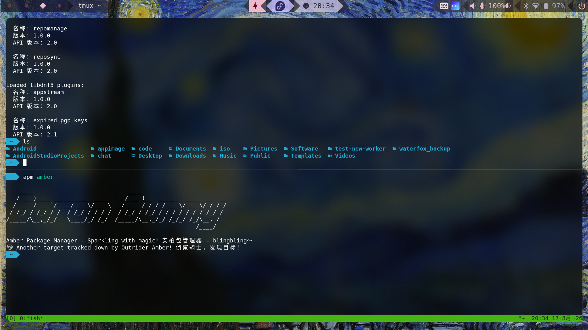

# lancetfish-niri-fedora

基于 [SHORiN-KiWATA/shorin-niri](https://github.com/SHORiN-KiWATA/shorin-niri) 的 Niri 桌面配置，经过个人定制与调整。

> **声明：** 本项目基于 shorin-niri 配置，部分内容由 AI 辅助生成和调整。如果显示网络问题建议开个代理 （fedora如果安装不上karing显示依赖不可用，可以先不用那个依赖 后面慢慢补依赖 不影响） 由于改动巨大所以决定重新设置一个仓库
## Preview 预览图

## 为什么选择我们

- 首先，我们的foot十分美观 
- 其次，我们的foot占用十分小
- 还有，我们的这几句话的主语用的是我们，
- 最后，觉得有问题可以提交议题，觉得没问题可以发到youtube,x,bilibili上炫耀一下哦(@_@)

详细的使用方法、快捷键说明、输入法配置等请参考原版项目：

- [shorin-niri 原版仓库](https://github.com/SHORiN-KiWATA/shorin-niri)
- [功能介绍文档](https://github.com/SHORiN-KiWATA/Shorin-ArchLinux-Guide/wiki/ShorinNiri%E5%8A%9F%E8%83%BD%E4%BB%8B%E7%BB%8D)

## 致谢

感谢 [SHORiN-KiWATA](https://github.com/SHORiN-KiWATA) 提供的优秀 Niri 桌面配置方案。
感谢 [ThousandPairsThousandWings](https://github.com/ThousandPairsThousandWings/niri-withstar-animations-open-and-close-windows.git)提供的漂亮的动画
